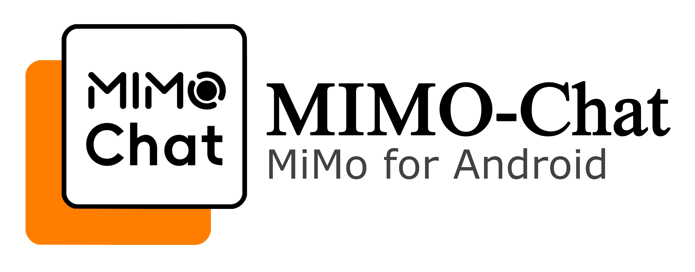

  

 

MIMO Chat - 第三方小米 MiMo 大模型 Android 客户端

---

> [!NOTE]
> An Android client built with Kotlin that provides quick integration with the Xiaomi MiMo series Large Model APIs. Features include LaTeX rendering, custom prompts, and large model skills
> 
> 基于 Kotlin 开发的安卓客户端，快速接入小米 MiMo 系列大模型 API，支持 LaTeX 渲染、自定义提示词与大模型技能等功能

> [!TIP]
> **关于 MiMo 100T Token 计划的说明**
> 
> 若你正在使用小米 [百万亿 Token 创造者激励计划](https://100t.xiaomimimo.com/) 所赠送的 Token，请在设置中**将 API Base URL 更改为订阅接口**

> [!TIP]
> **关于通知栏保活功能的说明**
> 
> 部分厂商定制系统会限制非应用商店下载应用的通知权限。为保障服务的稳定性，请自行前往设置中**确认已开启本应用的通知权限**，本应用不会自行弹窗提醒用户开启通知，以尊重用户的选择权。

---

## ✨ 功能

- 多模型切换支持
- 代码块渲染
- 较完整的 LaTeX 公式渲染(*包含化学公式等额外扩展*)
- 思考过程展示
- 对话历史管理
- 深色模式跟随
- 莫奈取色主题
- 自定义系统提示词
- 手机端与 Pad 端自适应布局
- 通知栏保活

## 🚀 快速开始

### 安装

#### 方式一：从 GitHub Releases 下载（推荐）

1. 访问本项目的 [Releases](https://github.com/MRoldL001/MIMO-Chat/releases)
2. 下载最新的 `.apk` 文件
3. 在手机上安装（可能需要允许未知来源应用）

#### 方式二：从源码构建

> [!WARNING]
> 对于普通用户，不推荐自行从源码构建，因为其更为繁琐，且构建 `.apk` 时：
> 
> 如果构建 `debug` 包，则安装包体积会更大，且因为有调试标签，无法通过系统安装器安装
> 
> 如果构建 `releases` 包，为了安全性开发者所持签名密钥不会被公开，在自行签名的情况下每次更新需要用同一组密钥重新构建安装包，无法直接更新开发者所发布的 `.apk` 安装包

1. 使用 `git clone` 将 Repo 克隆到本地
2. 使用 `Android Studio` 或者其它任何装了 Android 开发插件的`Jetbrains IDE` 打开项目
3. 同步 `Gradle`
4. 运行或构建 `.apk`，建议自签名构建 `releases` 安装包

### 配置

1. 首次打开应用，点击右上角设置图标
2. 设置你的小米 MiMo API Key
3. （可选）配置 API Base URL
4. （可选）设置自定义系统提示词
5. 开始聊天！

## 📱 设备要求

- Android 7 (API 24) 或更高版本
- 莫奈取色主题仅支持 Android 12 (API 31) 或更高版本
- 同时支持手机和平板设备，并有 UI 区分

## 🎨 主题

应用支持多种主题颜色：

| 主题     | 主色调       |
| ------ | --------- |
| 默认（白色） | 黑白系       |
| 莫奈取色   | 跟随系统主题色   |
| 小米橙    | `#FF7E00` |
| 初音绿    | `#39C5BB` |
| 盎然绿    | `#006E2A` |
| 罗兰紫    | `#6650A4` |

## 📖 使用说明

### 发送消息

在底部输入框输入内容，点击发送按钮发送消息。

### 切换模型

点击顶部当前模型名称，在弹出的模型选择器中选择其他模型。

### 查看思考过程

当 AI 启用思考模式时，可以点击展开"思考过程"卡片查看 AI 的推理过程。

### 复制代码

代码块右上角提供复制按钮，点击即可复制代码内容。

### 管理对话

- 新建对话：点击侧边栏新建按钮
- 选择对话：点击侧边栏中的历史对话
- 删除对话：在对话列表中点击删除图标

## 🔧 高级功能

### 思考模式

启用后，AI 会展示其思考推理过程，适合学习和理解 AI 的思维方式。

### 技能模式

- **诗人模式**：将你输入的内容转化为古体诗
- **学习模式**：采用循序渐进的教学方式，帮你学习新知识

### 自定义提示词

在设置中可以添加自定义系统提示词，自定义 AI 的行为和风格。

## 📄 免责声明

### 非官方声明

本应用（MIMO Chat）为第三方开发的开源客户端，**与小米公司（Xiaomi Corporation）及其关联公司(下称小米公司)无任何隶属、授权或合作关系**。

### 知识产权

“小米”、“Xiaomi”、“MiMo” 等商标及图形标识归小米公司所有。本应用使用上述标识仅用于描述功能兼容性（**即指示性合理使用**）。

### 隐私保护

本应用所有数据均存储在本地设备，对话直接通过 API 与小米服务器通信，开发者不收集或存储任何用户数据。

### 风险承担

**本应用按“as-is”提供，不包含任何明示或暗示的保证**。用户需自行承担使用本应用带来的风险，包括但不限于数据丢失、隐私泄露或设备损坏。开发者与小米公司不对本应用的合法性、安全性及功能性负责。

### 反馈与支持

若在使用中遇到问题，请前往 [Issues](https://github.com/MRoldL001/MIMO-Chat/issues) 反馈，若有能力也可尝试 fork 源码自行修改后发起 PR。